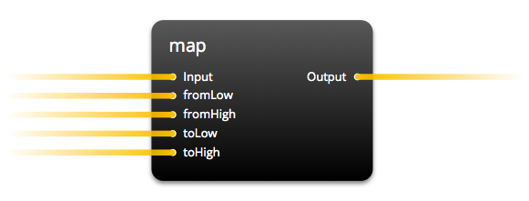
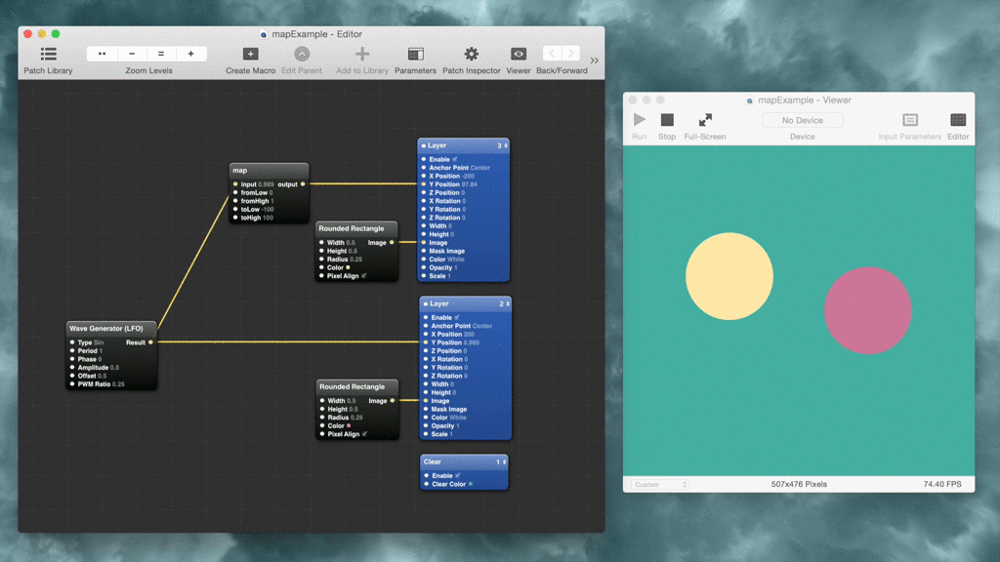
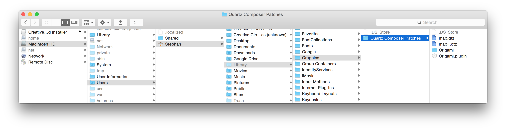
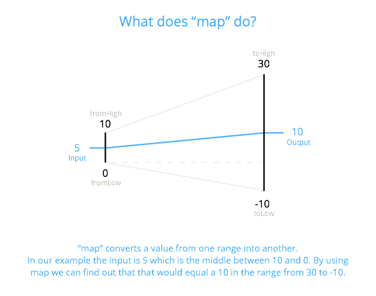

# map function for [Quartz Composer](http://en.wikipedia.org/wiki/Quartz_Composer)

## Description

Re-maps a number from one range to another. That is, a value of fromLow would get mapped to toLow, a value of fromHigh to toHigh, values in-between to values in-between, etc.

Does not constrain values to within the range, because out-of-range values are sometimes intended and useful.

Ported from [Arduino](http://www.arduino.cc/en/Reference/Map) to Quartz Composer patch.

The example uses patches from Facebook's [Origami](http://facebook.github.io/origami/), which I encourage you to install instantly, because it is the best thing that happened to Quartz Composer for interface prototyping.

## Installation

Drop the file into `Users ▶ {You} ▶ Library ▶ Graphics ▶ Quartz Composer Patches`

Note that the folder Library is hidden but [you can make it visible](http://ianlunn.co.uk/articles/quickly-showhide-hidden-files-mac-os-x-mavericks/).

## Usage
- input: Input value you want to convert from one scale to another
- fromLow: lower end of input scale
- fromHigh: upper end of input scale
- toLow: lower end of output scale
- toHigh: upper end of output scale

## What can you do with it?
Let's say you have an output value of a patch. For example a tap - which has the states 1 or 0. But you want to animate something. If "tap" is 0 an image should be at y-position 248 and if "tap" is 0 it should be -50. You would set:

- Connect tap state to input
- fromLow as 0 (because tap state toggles between 0 and 1)
- fromHigh as 1 (same reason as above)
- toLow as 248 (because you want this to be the position when "tap" is 0)
- toHigh as -50 (because you want this to be the position when "tap" is 1)

## License
Public Domain

## More
- Colors taken from the great game [Monument Valley](http://www.monumentvalleygame.com/)
- Gif created with [GifRocket](http://www.gifrocket.com/)